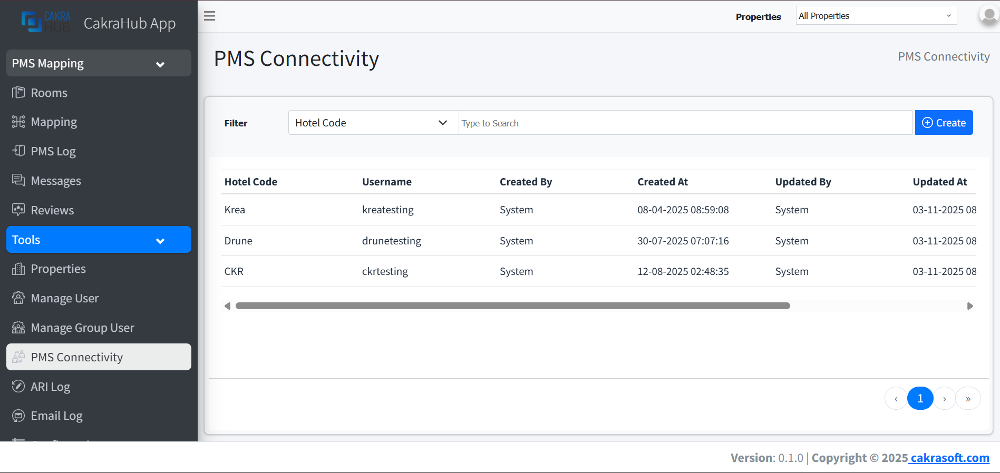
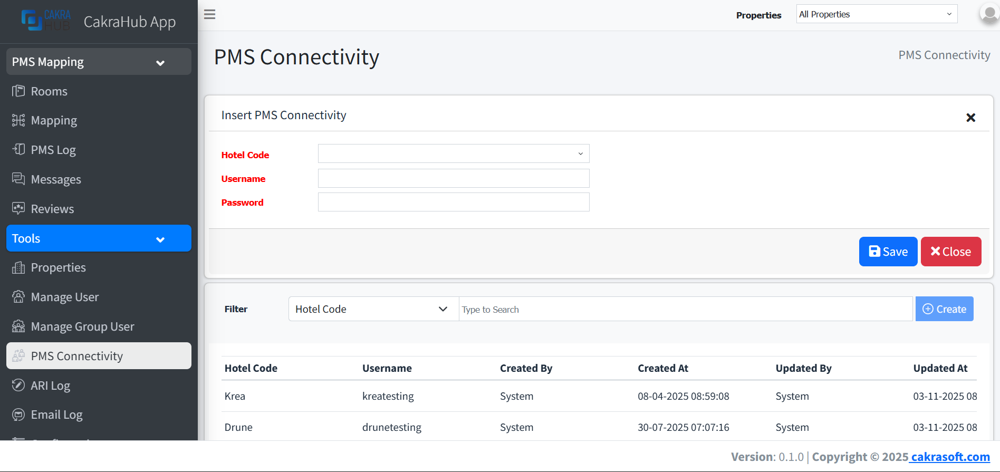

# Generate Credential

To connect to the Cakrahub Channel Manager API, you need to generate username and password. Follow these steps:

## 1. Go to PMS Connectivity Menu
- On the left sidebar, choose **PMS Connectivity**.

## 2. Create API Access
- Click the **+ Create** button at the right top of the page.

## 3. Fill in the PMS Connectivity Form

- **Hotel Code**: Choose the hotel for which you want to generate the connectivity credentials.
This ensures the username and password will be linked to the correct property.
- Enter the username and password that will be used for API authentication
- After filling in all fields, click Save to generate or update the connectivity credentials.
These credentials will be required when making API requests using Basic Authentication.

## 4. Copy and Use Your Credential
- After generating, your new username and password will appear in the list. Use this username and password in your API requests as required.

> **Note:** If you do not see the PMS Connectivity menu, please contact your administrator for access.
