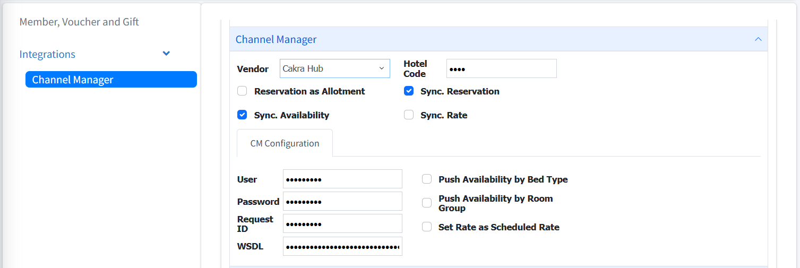

# Setup Channel Manager Connection Documentation
This section explains how to connect the PMS to the Cakrahub Channel Manager. The setup process ensures that the PMS can send and receive data—such as reservations, availability, and room rates—through the Channel Manager integration.

## 1. Accessing the Channel Manager Settings
To configure the Channel Manager connection, the user must first navigate to the correct settings page within the PMS:
1. Go to the Tools menu in the top navigation bar.
2. Select Settings.
3. In the left panel, open the Integrations section.
4. Click Channel Manager to display the configuration form.

## 2. Configuring the Channel Manager Connection
  
  
Once on the Channel Manager screen, you will need to enter the required credentials and connection details:

- `Username`
- `Password`
- `Hotel Code`

These credentials can be obtained from the PMS Connectivity menu inside the Cakrahub Channel Manager dashboard.

Additionally, you must provide the `WSDL URL`, which represents the base API endpoint of the Channel Manager. This URL tells the PMS where to send all integration requests.

Once all fields are correctly filled in, the PMS will be connected to the Channel Manager and ready to synchronize data.