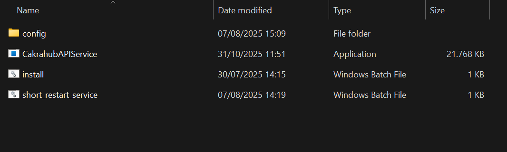
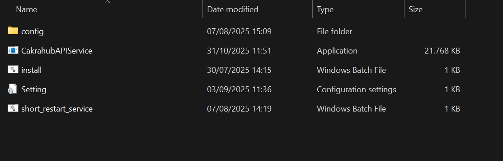

# Setup Service on Client's Computer Documentation

This section provides instructions for installing and configuring the service on the client’s computer. It covers all required steps, including environment setup, dependency installation, credential configuration, and ensuring the service runs correctly on the client’s local machine.

To begin the setup, make sure you have all the required files ready. Also ensure that you have already accessed the `Service Channel Manager` page in the PMS before continuing with the installation process.

## 1. Ensure all required files are complete
Make sure the following files and folders are present before starting the setup:
  
- `config folder`
  Inside the config directory, you will find several configuration files used by the service:
    - `config` — Go source file used internally by the application (not intended for manual editing).
    - `config-docker.yaml` — Configuration file used when running the service inside a Docker environment.
    - `config-local.yaml` — The main configuration file used for local or client-side installations.
- `install.bat`
- `restart.bat`
- `CakrahubAPIService` executable file

## 2. Run the Service and Configure Database Connection
After that, run the CakrahubAPIService file as Administrator. You will then need to configure the integration with the client’s database by entering the required information, such as the database host, port, username, and password. Once the configuration is completed, a `Setting.ini` file will be automatically generated, containing the database connection details.
These files are necessary for the installation and proper operation of the service on the client’s computer.
  

After completing, check the `CakrahubAPIService.txt` log file to verify whether any errors occurred. Make sure the service is running without issues before proceeding to the service installation step. This log file is generated automatically after running CakrahubAPIService as Administrator.

## 3. Install the Service
To install the service, run the `install.bat` file as Administrator. After the installation process completes, open Task Manager and go to the Services tab. Check whether the `CakrahubAPIService` entry is listed and whether its status is Running. If the service appears and is running, the installation was successful.

## 4. Create a Shortcut for Restarting the Service
As the final step, create a shortcut to simplify how the client restarts the service in case it stops running.
1. Locate the `short_restart_service` file.
2. Right-click the file → Send to → Desktop (create shortcut).
3. On the desktop, right-click the created shortcut → Properties.
4. Click Advanced → enable Run as Administrator.
5. (Optional) Change the shortcut icon to make it more user-friendly.
This shortcut allows the client to restart the service quickly and safely whenever needed.
